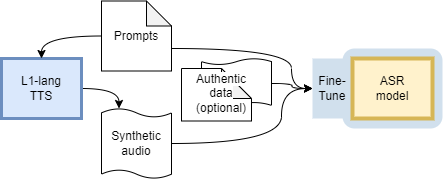

# Multilingual TTS Accent Impressions for Accented ASR

This is the public repository containing the scripts used to process and generate synthesized
data, and use them to fine-tune huggingface's the `wav2vec2.0-base` model. The corresponding paper will be published soon.

Repository structure:
- `data_prep`: Contains the python scripts used to prepare the common voice and l2-arctic datasets.
- `data_synth`: Contains code for synthesizing accented speech using Microsoft's TTS service (note that you need an API key). It also contains the gutenberg prompts that were used to produce the accented data.
- `train`: Contains code to finetune a `wav2vec 2.0` model using hugginface's transformers.

Please install all dependencies (`pip install -r requirements.txt`) before trying to use any of our scripts.

*Keywords: accented speech recognition, data augmentation, low-resource speech technologies, speech synthesis*

## Abstract

Automatic Speech Recognition (ASR) for high-resource languages like English is often considered a solved problem. However, most high-resource ASR systems favor socioeconomically advantaged dialects. In the case of English, this leaves behind many L2 speakers and speakers of low-resource accents (a majority of English speakers). One way to mitigate this is to fine-tune a pre-trained English ASR model for a desired low-resource accent. However, collecting transcribed accented audio is costly and time-consuming. In this work, we present a method to produce synthetic L2-English speech via pre-trained text-to-speech (TTS) in an L1 language (target accent). This can be produced at a much larger scale and lower cost than authentic speech collection. We present initial experiments applying this augmentation method. Our results suggest that success of TTS augmentation relies on access to more than one hour of authentic training data and a diversity of target-domain prompts for speech synthesis.

## Introduction



## Data

We used the common voice (version 8, English-only) and L2-Arctic databases. Our version of common voice (the data we ended up using), contained a total of 3 accents (German, Malay, and Filipino), while L2-Arctic contained 6 accents (Arabic, Chinese, Hindi, Korean, Spanish, Vietnamese). More details about the structure of the data and the preprocessing steps we took can be found in the paper (and the code under the `data_prep` directory). The reason we chose common voice and l2-arctic is because, at the time of our experiments, there weren't any other freely available, clearly annotated accented speech datasets. Shortly after our publication, the [`Edinburgh International Accents of English Corpus`](https://datashare.ed.ac.uk/handle/10283/4836), so future experiments could also take advantage of that database.

### Synthesised Data (TTS)

The `data_synth` directory contains code that was used to generate the synthesized accented audio data.
The main functionality of these scripts is taken from the
[`Multilingual_TTS_Augmentation`](https://github.com/n8rob/Multilingual_TTS_Augmentation) repo. The 
current repo will likely not follow any changes from the original repo, so if you want to use an 
up-to-date version of this work you should separately clone `n8rob`'s repository.

Note that in our paper there are multiple types of synthesized data. This is because we wanted to test the effectiveness of synthesized accented speech when assuming different levels of prior knowledge. For instance, in the most basic case, we use MS-TTS to synthesize audio from the training transcripts (after making sure that there is no overlap between the texts of the training sets and that of the test sets). This is an augmentation technique that is commonly used in ASR. Besides that, we also experiment with different sources of text, such as that from the Gutenberg corpus.

Regarding the metadata of our synthesized audio, we used a set of different speakers for each prompt. In particular, we sampled `n` speakers out of the list of available speakers in `data_synth/azure-voices.json`. We noticed the quality of certain voices was much higher than that of others which could many times be unintelligible. In addition, certain voices had almost perfect American English accents when they were given English text prompts.

Regarding the out-of-domain synthesized speech, we used a subset of the Gutenberg corpus to make the synthesis. In particular, we first sampled 33000 prompts and then preprocessed them. During this process we also removed 4896 prompts due to them containing non-ascii characters. The rest of the preprocessing included the removal of prompts with numerals, the removal of parentheses, colons, semicolons, apostrophes and the removal of excess spaces. The final number of Gutenberg prompts used to syntehsize speech was 28104.

## Citation

```
@inproceedings{accent_adaptation_tts,
  author = {Karakasidis, Georgios and Robinson, Nathaniel and Getman, Yaroslav and Ogayo, Atieno and Al-Ghezi, Ragheb and Ayasi, Ananya and Watanabe, Shinji and Mortense, David and Kurimo, Mikko},
  title = {Multilingual TTS Accent Impressions for Accented ASR},
  booktitle = {Text, Speech, and Dialogue},
  publisher="Springer International Publishing",
  year = {2023}
}
```